# SQL_PROJECT: Statistical Modeling and Analysis of 2023 Data Analyst Job Postings

To help navigate the job market, I scripted analysis in Python and querying SQL to, using statistical/machine learning techniques:
1. **Classify** de-facto sub-roles/skill-groupings subsumed by the 'Data Analyst' title
2. **Model** the marginal impact of skills among all skill-sets
3. **Distinguish** significantly higher/lower-paying companies, locale-adjusted. 

My interest here was to assess my bargaining power: How competative and how valuable will my skill-set be? Then, how approachable are higher-salarying skill-sets? How else do I optimize salary expectations, given the information commonly provided in job postings?

Results provide three feasible tactics, two immediate and one gradual, by which I can expect four-to-five figure increases in expected starting salary. 

### Approaches
1. **Skill-set Classification:** Dimensional Reduction (PCA, UMAP), Clustering (hierarchical, density-based)
2. **Skill-set -> Salary Modeling:** Decision Trees, Gaussian Mixed Models (random-intercept), 
3. **Company Salary Prediction:** Linear Regression

### Data
[2023 job postings data](https://drive.google.com/drive/folders/1moeWYoUtUklJO6NJdWo9OV8zWjRn0rjN) were scraped from google searches using SerpAPI and compiled by Luke Barousse. Of 787,686 results, 196,593 postings uniquely specified the Data Analyst role, with 5463 also explicitly noting base salary.

### Takeaways
1. Relevant languages/software (SQL, R, Python, Tableau, Power BI) co-associate among postings, while office skills co-associate (Excel, Powerpoint, Word). While listed among higher salaried postings on average, rarer skill groupings – cloud/server tools (AWS, Azure, Oracle) and analysis-specific tools (Looker, Snowflake, Flow) – do not co-associate but, rather, extend skill-sets. 

2. Office skills predict significantly and substantially lower expected salaries (p=5e-8, 10% expected reduction), even respective to otherwise identical skill-sets. Put simply, expect less compensation not only for postings listing excel+sql relative to python+sql; expect less for python+sql+excel than python+sql. This surprised me. 

3. Among non-office job groupings, Snowflake, Apache Spark, Azure, and MATLAB show greatest marginal benefits under inclusion (expected gain >$10,000, Cohen's d > 0.3). While job-specific tools (particularly Snowflake) may likely associate as a proxy for prior experience (itself causal), this explanation does not generalize among these marginally-benefitial skills.

4. Results give rankings and significances of company salaries relative to their postings' specified locations (for 2524 companies), allowing efficient prediction of premium-paying companies.

## Part 1: Classifying skill-sets

**Visualizing skills: [6_visualizing_skills.py](6_visualizing_skills.py)**

First, I visualized salary-associated Data Analyist postings by skills' frequency and mean associated salary:

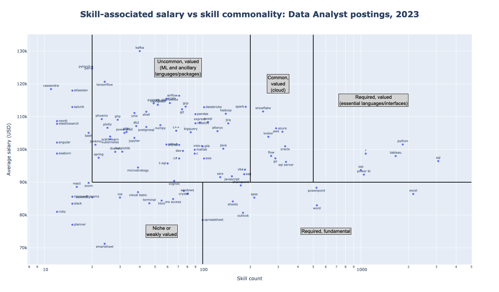

I saw intuitive groupings of skills: 
- Ubiquitous (required) and valued skills, often relevant languages/software (SQL, R, Python, Tableau, Power BI)
- Ubiquitous (required) but fundamental skills – many being Office-suite (Word, Powerpoint, Excel) or comparable
- Common but particularly value-associated skills: cloud/server tools (AWS, Azure, Oracle) and analysis-specific tools (Looker, Snowflake, Flow)

From this, I wondered: do skills co-associate, i.e. do these (or any) groupings reflect common skill-sets? Given this, I could then ask, do different skill-sets map to sub-roles – or, as is evidenceable here, do skill-sets predict different salaries? Do you make more as a 'cloud' Data Analyist or do individual, disparate cloud/server/niche tools bring benefit in isolation – might I benefit to learn one? 

**Classifying skill-sets: [7_clustering_skills.py](7_clustering_skills.py)**

To answer these questions (to classify skill-sets), I employed dimensional reduction and clustering algorithms on skill specifications per posting. I ran Principal Components Analysis, both as a dimensional reduction tool (albeit among low-feature data) and to generate intuition.

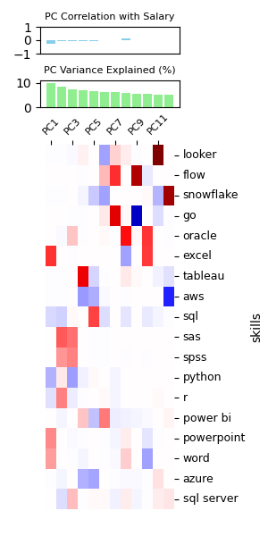

Interestingly, while agnostic to starting salary (explicitly), PC1 values slightly negatively correlate (r=0.25) with salary, with PC1 exhibiting strong positive loadings among Office skills (Excel, Powerpoint, Word) and negative among programming (SQL, Python, R). Using these loadings, I ran UMAP to visualize proximate skill associations (and their frequencies). I, then, clustered these by UMAP-coordinates' densities (DBSCAN), marking clusters exhibiting FDR-corrected (BH-procedure, alpha=0.05) significant salary deviations from the average:

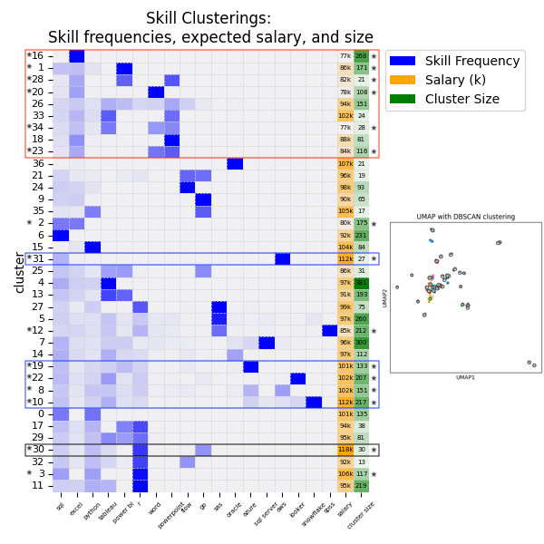

Results depict rough mutual exclusion of software skills from Office clusters (top/orange; some SQL seen) and vice versa among software skilled roles. Office clusterings consistently pay less, with half showing significant negative associations with salary, with most averaging 70-90K. Conversely (in both regards), cloud/server/niche skills don't cluster, independently clustering ubiquitous+valued languages/software (SQL, R, Python, Tableau, Power BI), and these substantially bolster earnings: clusters featuring AWS, Azure, Looker, Snowflake and GO (7% of postings) feature significantly higher salaries, with cluster means between $100-120k. 

Notably, these clusterings still demonstrate skill heterogeneity and were generated agnostic to salary, so I can't yet identify the importance (effect on salary) of skills within skill-sets. 

## Part 2: Skill-set -> Salary Modeling

**Skill-Salary Regression – Decision Tree: [8_skillEarnings_decisionTree.py](8_skillEarnings_decisionTree.py)**

To approach this question – identifying skills of most substantial marginal effect within skill-sets – I populated a decision tree to conditionally predict salary under binary skill inclusion/exclusion. Under this approach, skill-sets of increasing specificity are iteratively differentiated by inclusion/exclusion of the skill best accounting for salary variance. Minimal node size and depth were parametrically swept, retaining the model featuring strongest cross-validation.

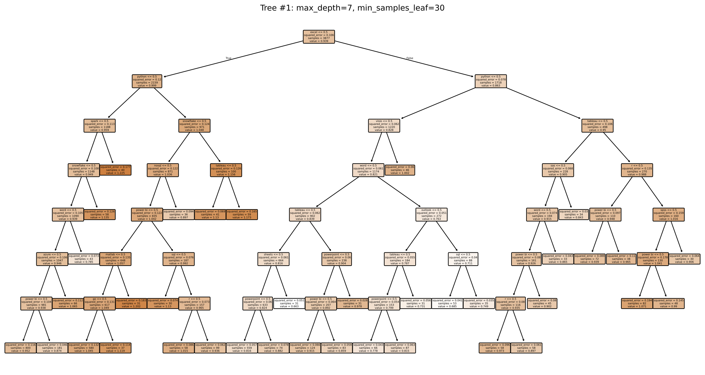

Immediate interpretations qualitatively agree – non-Office roles offer higher average salaries: 
- If excluding Excel and including Python (-Excel, +Python), i.e. excluding Office-roles and including programming tools, expect $100k-$120k. 
- If +Excel, -Python, expect $70k-90k. 

Interestingly, remaining Excel/Python configurations suggest an additively detrimental effect of Excel:
- If +Excel, +Python, one might expect a negligable effect on salary relative to -Excel, +Python – both include the valuable skill/skill-cluster (Python). Results suggest the contrary: $80k-$100k relative to $100k-$120k. 
- If -Excel, -Python (exclusive), one expects $95k. With valuable/niche skills, salaries return to $100k-120k. 

These results do not yet necessitate a detrimental effect of Office-suite skills on salary expectations: Perhaps value-additive skills disproportionately associate with non-Office skill-sets. 

But, these results do quantify the benefits of the distinctly clustering, tech-additive skills observed in part 1: 

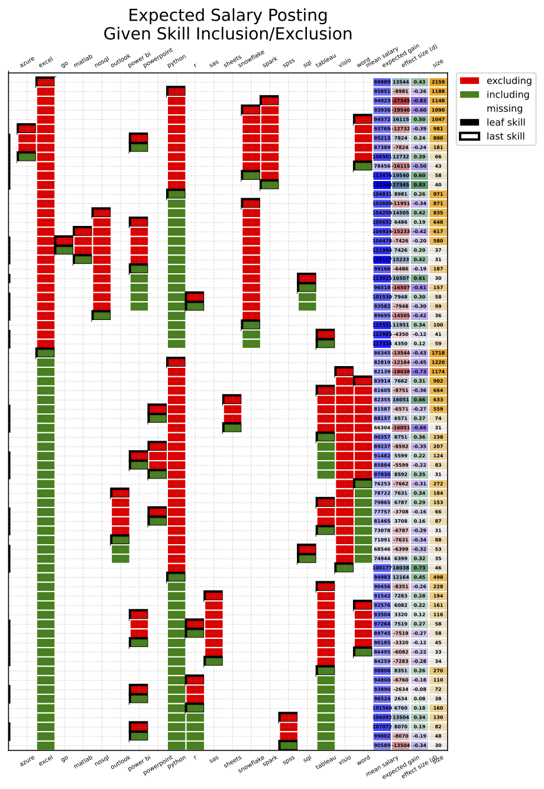

I, here, visualize skill-sets (skills included/excluded), marking parent node skills (bounding box) along with expected value, expected value gained under parent skill inclusion/exclusion, child node size, and effect size between sibling nodes (Cohen's d). Snowflake, Apache Spark, Azure, and MATLAB show greatest marginal benefits under inclusion in -Excel nodes (expected gain >$10,000, Cohen's d > 0.3) with mean salaries exceeding $110k (save Spark). Snowflake, in particular, suggests a potential confound: Field-specific skills correlate with or serve as proxy for prior experience. While investigating this confound is beyond the scope of this dataset, the premium associated with MATLAB runs contrary to the predominance of this effect. 

As a caveat fundamental to this approach, highly co-associated skills (SQL after Python or Powerpoint after Excel) should have little marginal impact, given co-clustering, likely obscuring their stand-alone predictive power – not that I'm particularly interested in this. 

**Skill-Salary Regression – Modeling Office-skill inclusion: [9_skillExclusion_mixedLM.py](9_skillExclusion_mixedLM.py)**

I, then, wanted to answer the question: Do Office skill mentions among skills directly decrease expected salaries? Specifically, for any Office skills and all sets of non-Office skills, is there a difference between groups: A – sets of [non-Office skills]+[Office skills] and B – sets of [non-Office skills] (i.e. Office-inclusive skill-sets and non-Office skill-sets). Two confounds obscure this question: 1. Skills co-associate, meaning Office skill-associable effects may non-causally depend on a co-associated and causal skill inclusion/exclusion. 2. Data sizes vary substantially, meaning each pair of Office+non-office vs non-office comparisons features variation in both non-office effect as well as the prevalence of this effect. 

First, as a probing approach, I compared means of each comparison: for each [non-Office skill-set], mean([Office]+[non-Office]) - mean([non-Office]):

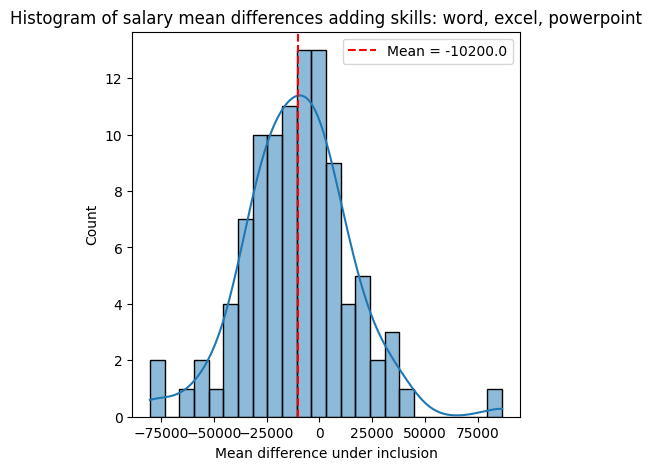

While not statistically sound, results suggest a general effect of notable average magnitude – the average difference between equivalent non-Office and non-Office+(any) Office skill-sets is $10k. 

To model this rigorously, I, assuming a Gaussian random variable well described the distribution of average salaries per skill-set, generated a random-intercept mixed model. The binary presence of any Office-skill inclusion differentiated entries into two fixed-effect groups, and the contribution of each entry's non-Office skill-set on salary was modeled as a random variable. 

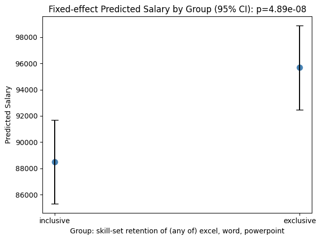
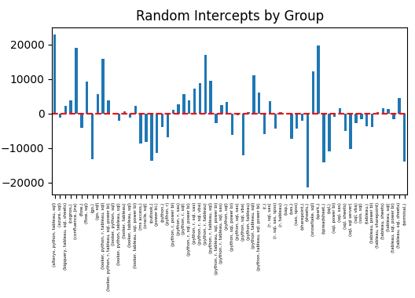

Model outputs show a highly statistically significant (p=5e-8) reduction of $9k (10%) from expected posting salary under inclusion of any Office skill (Excel, Word, Powerpoint). Instances of common non-Office skill-sets show BH-corrected significance as well (Python+R+SQL, Python+SQL+Tableau+Power BI): 

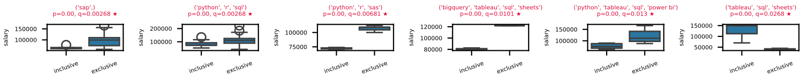

While I found these results counterintuitive – I figured Office skill-sets depressed salaries in lieu of more valuable skills and in association with less valuable skills – this is a highly actionable result: expect a four-to-five-figure higher salary under postings specifying Python+SQL+R relative to Python+SQL+R+Excel+Powerpoint.

## Part 3: Company Salary Prediction

**Salary Regression: [10_salary_olsRegression.py](10_salary_olsRegression.py)**

Last, I applied linear regression (OLS) to model companies' salaries as a function of location of their job-postings (as proxy for cost of living). Given this, residuals give relative location-adjusted salaries, which identify companies offering premium/discounted salaries. 

While this model neglects component of companies' salary postings attributable to skill-set variation, I have no interest in identifying companies posting the highest-salaried Office-skill jobs. Conversely, if a well-compensating company commonly/ubiquitously prioritizes a valuable secondary skill, I would not want their position discounted. 

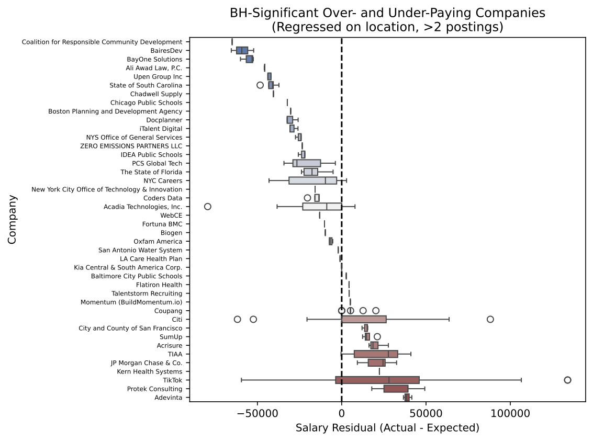

Among 2524 companies, I continued with the 330 contributing 3+ postings, subjecting residuals' p-values (one-sample test against mu=0) to BH-correction at alpha=0.05 (significant hits plotted above), with many underpaying groups associated with governmental groups or public services.

For a more pragmatic approach reducing the burden of FDR correction, I, then, focused on the 117 companies comprising 33% of postings, reapplying the BH-procedure (alpha=0.05). Results (mean +/- SEM) allow for prioritized company focus, with a portion of variance being irrelevant given my restricted subset of skill-sets of interest (which, in retrospect, might have been a useful initial filter).

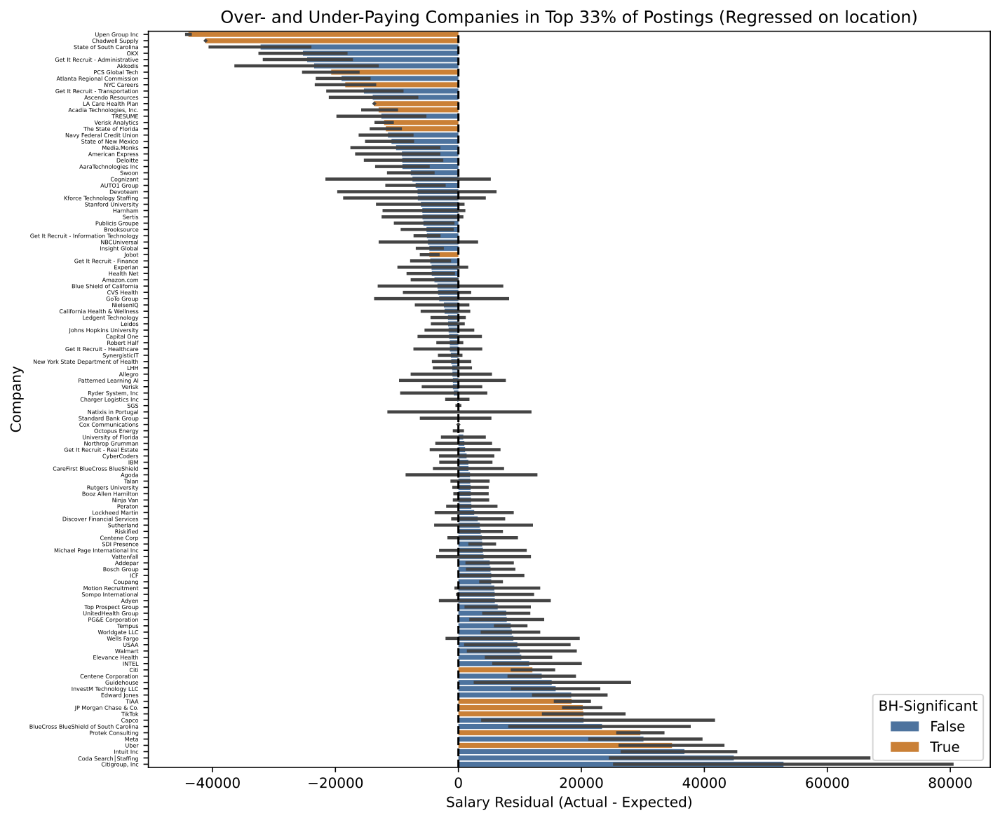

## Final Thoughts

One definition of Euler's number is the the limit of one over the likelihood of a Bernoulli trial's failure in all outcomes repeated as many times as it is unlikely (1/100 run 100-times) as trial number goes to infinity. So, one doesn't really get a sense of one's competativity for a 1/x role until they complete around x applications, which can be a very time-consuming way to determine one's competitivity. 

Here, I developed a sense for my general competitivity given my skill-set – specifically that I do well meet the qualifications of most valuable roles, given the overlap between my skill-set and postings' co-associated set of software/language skills. 

I resolved tangible tactics towards a high starting salary: avoid roles listing Office skills, find roles in which my MATLAB background is valuable, avoid government-associated roles, and, perhaps, show employers a project involving cloud-interfacing or Analyst-specific software such as Power BI, Tableau, or Snowflake. 

Overall, I found this project a fun exercise with results lending to tangible optimizations in my job-search process. 

## Additional Resources

### SQL-generated files:

**KEY: MA** indicates With locale specificity (Boston, Cambridge, Somerville, Lexington, Worcester, Watertown and Waltham)

**avgSalary_role_company.csv (MA)** lists average salaries per role per company

**avgSalary_role_location.csv** lists average salaries per role among Boston, Cambridge, and NYC

**counts_per_MAjob.csv (MA)** lists average salary and count per job role among MA areas
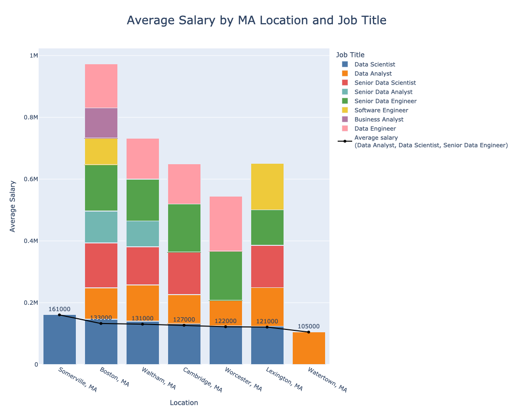

**skills_per_MAjob.csv (MA)** lists (fractional) frequencies of each skill per job title

**jobSkills_long.csv** lists count (>10) and average salary for each skill listed